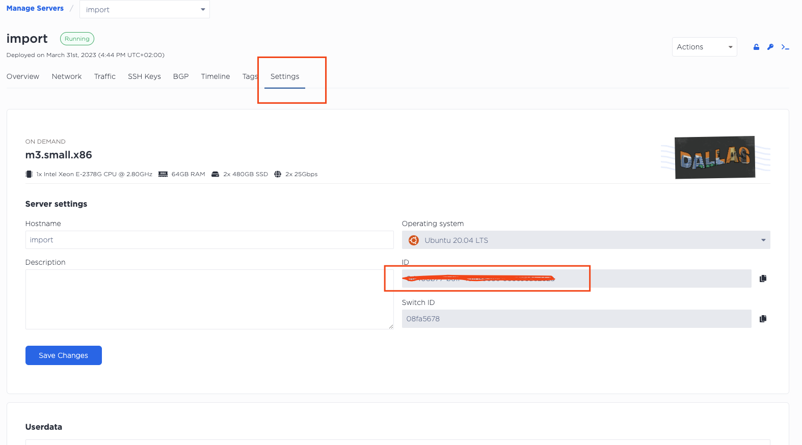

# metal-device-import
Equinix Metal - import existing device

## Pre-requirement
- [Equinix Metal](https://console.equinix.com/) account 
- [Terraform](https://www.terraform.io/)

## Steps to execute

- create Equinix Metal server via the portal
- copy the device ID under - `device -> Settings -> ID` (screenshot below)

- create terraform configuration with empty resource - `main.tf`

```
tee -a main.tf > /dev/null <<-EOD
terraform {
  required_providers {
    equinix = {
      source = "equinix/equinix"
    }
  }
}

resource "equinix_metal_device" "web1" {}
EOD
```
- init the configuration
```
terraform init
```

- import the existing configuration
```
terraform import equinix_metal_device.web1 DEVICE-ID
```

- the output example

```
$ terraform init

Initializing the backend...

Initializing provider plugins...
- Finding latest version of equinix/equinix...
- Installing equinix/equinix v1.13.0...
- Installed equinix/equinix v1.13.0 (signed by a HashiCorp partner, key ID 1A65631C7288685E)

Partner and community providers are signed by their developers.
If you'd like to know more about provider signing, you can read about it here:
https://www.terraform.io/docs/cli/plugins/signing.html

Terraform has created a lock file .terraform.lock.hcl to record the provider
selections it made above. Include this file in your version control repository
so that Terraform can guarantee to make the same selections by default when
you run "terraform init" in the future.

Terraform has been successfully initialized!

You may now begin working with Terraform. Try running "terraform plan" to see
any changes that are required for your infrastructure. All Terraform commands
should now work.

If you ever set or change modules or backend configuration for Terraform,
rerun this command to reinitialize your working directory. If you forget, other
commands will detect it and remind you to do so if necessary.
$ terraform import equinix_metal_device.web1 <DEVICE-ID>
equinix_metal_device.web1: Importing from ID "<DEVICE-ID>"...
equinix_metal_device.web1: Import prepared!
  Prepared equinix_metal_device for import
equinix_metal_device.web1: Refreshing state... [id=<DEVICE-ID>]

Import successful!

The resources that were imported are shown above. These resources are now in
your Terraform state and will henceforth be managed by Terraform.
```

- terraform show will show the imported device

```
$ terraform show
# equinix_metal_device.web1:
resource "equinix_metal_device" "web1" {
    access_private_ipv4              = "10.70.47.133"
    access_public_ipv4               = "147.75.53.17"
    access_public_ipv6               = "2604:1380:4641:9300::3"
    always_pxe                       = false
    billing_cycle                    = "hourly"
    created                          = "2023-03-31T14:44:10Z"
    deployed_facility                = "da11"
    facilities                       = [
        "da11",
    ]
    force_detach_volumes             = false
    hostname                         = "import"
    id                               = "<DEVICE-ID>"
    locked                           = false
    metro                            = "da"
    network                          = [
        {
            address = "147.75.53.17"
            cidr    = 31
            family  = 4
            gateway = "147.75.53.16"
            public  = true
        },
        {
            address = "2604:1380:4641:9300::3"
            cidr    = 127
            family  = 6
            gateway = "2604:1380:4641:9300::2"
            public  = true
        },
        {
            address = "10.70.47.133"
            cidr    = 31
            family  = 4
            gateway = "10.70.47.132"
            public  = false
        },
    ]
    network_type                     = "layer3"
    operating_system                 = "ubuntu_20_04"
    plan                             = "m3.small.x86"
...
```

- depends on the configuration, you have to copy output of `terraform show` and paste it in main.tf file so you have the configuration of the device in terraform 

```
resource "equinix_metal_device" "web1" {
  always_pxe       = false
  billing_cycle    = "hourly"
  hostname         = "import"
  metro            = "da"
  operating_system = "ubuntu_20_04"
  plan             = "m3.small.x86"
  project_id       = "<PROJECT-ID>"
  storage = jsonencode(
    {
      disks       = null
      filesystems = null
    }
  )
}
```

- run terraform apply to check. there should not be any new changes

```
$ terraform apply
equinix_metal_device.web1: Refreshing state... [id=<DEVICE-ID>]

No changes. Your infrastructure matches the configuration.

Terraform has compared your real infrastructure against your configuration and found no differences, so no changes are needed.

Apply complete! Resources: 0 added, 0 changed, 0 destroyed.
```